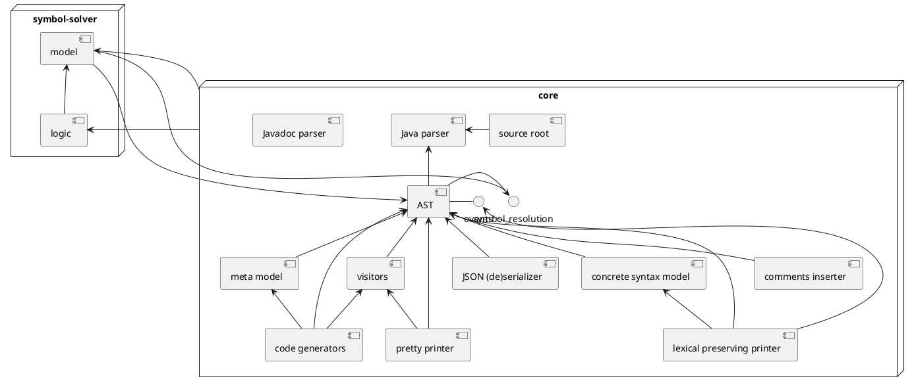

# JML Parser

This project provides a library for the parsing of Java with 
the Java Modelling Language (JML). JML is a formal specification 
for Java to decribe the functional behavior, e.g., 
pre- and post-conditions of methods, class and loop invariants.

The bases of this project is the [Java Parser]https://github.com/javaparser/javaparser)
project, which is extended in the following ways:

* new lexer and grammar rules 
* new AST classes and also new attributes for `Block`, `WhileStatement`, 
  `ForStatement`, `DoStatement`, and `CallableDeclaration` (constructors and methods).
* (TODO) extension of the name resolution  

## JML AST Classes 
* Behavior 
* Jmlish 
  * JmlLogicType 
  * JmlStatement 
    * JmlStmtWithExpression 
    * JmlUnreachableStmt 
    * JmlGhostStatements 
    * JmlSetStmt 
    * JmlRefiningStmt 
  * JmlName 
  * JmlClassLevel 
    * JmlRepresentsDeclaration 
    * JmlFieldDeclaration 
    * JmlClassAccessibleDeclaration 
    * ClassInvariantClause
  * LocationSetExpression 
    * LocationSetPrimary 
    * LocationSetLiftExpression 
    * LocationSetArrayAccess 
    * LocationSetBindingExpr 
    * LocationSetFunction 
    * LocationSetFieldAccess 
  * JmlClause 
    * JmlClauseE 
    * CapturesClause 
    * SignalsClause 
    * OldClause 
    * JmlClauseHL 
    * DurationClause 
    * SignalsOnlyClause 
    * JmlClauseHE 
    * CallableClause 
    * JmlClauseLE 
    * ForallClause 
  * JmlContract 
  * JmlContainer
    * JmlBodyDeclaration
    * JmlContracts 
  * JmlSetComprehension 
  * JmlStatements 

```plantuml
@startuml
class com.github.javaparser.ast.jml.clauses.AccessibleClause {
- NodeList<SimpleName> heaps
- NodeList<LocationSetExpression> exprs
- Expression measuredBy
}
class com.github.javaparser.ast.jml.DefaultJmlContainer {
}
class com.github.javaparser.ast.jml.locref.LocationSetLiftExpression {
- NodeList<Expression> arguments
}
class com.github.javaparser.ast.jml.clauses.JmlContracts {
- boolean singleLine
- NodeList<SimpleName> jmlTags
- NodeList<JmlContract> elements
}
class com.github.javaparser.ast.jml.clauses.WorkingSpaceClause {
}
abstract class com.github.javaparser.ast.jml.body.JmlClassLevel {
}
class com.github.javaparser.ast.jml.clauses.JmlClauseLE {
- SimpleName label
- Expression expr
}
abstract class com.github.javaparser.ast.jml.clauses.JmlClause {
- JmlClauseKind kind
}
class com.github.javaparser.ast.jml.clauses.LoopInvariantClause {
- Expression expr
}
class com.github.javaparser.ast.jml.clauses.EnsuresClause {
- NodeList<SimpleName> heaps
- Expression expr
}
class com.github.javaparser.ast.jml.expr.JmlSetComprehension {
- VariableDeclarator binding
- Expression predicate
}
class com.github.javaparser.ast.jml.clauses.SignalsOnlyClause {
- NodeList<Type> types
}
class com.github.javaparser.ast.jml.clauses.CallableClause {
}
class com.github.javaparser.ast.jml.stmt.JmlStatements {
- boolean singleLine
- NodeList<SimpleName> jmlTags
- NodeList<JmlStatement> elements
}
class com.github.javaparser.ast.jml.clauses.CapturesClause {
}
class com.github.javaparser.ast.jml.locref.LocationSetPrimary {
- Kind kind
}
class com.github.javaparser.ast.jml.stmt.JmlSetStmt {
- Expression rhs
- Expression lhs
}
class com.github.javaparser.ast.jml.clauses.DivergesClause {
}
class com.github.javaparser.ast.jml.clauses.JmlClauseHE {
- NodeList<SimpleName> heaps
- Expression expression
}
class com.github.javaparser.ast.jml.clauses.JmlContract {
- Behavior behavior
- NodeList<Modifier> modifiers
- NodeList<JmlClause> clauses
- NodeList<JmlContract> subContracts
}
class com.github.javaparser.ast.jml.clauses.LoopVariantClause {
}
class com.github.javaparser.ast.jml.body.JmlRepresentsDeclaration {
- NodeList<Modifier> modifiers
- SimpleName id
- Expression expr
}
class com.github.javaparser.ast.jml.locref.LocationSetFieldAccess {
- LocationSetExpression scope
- SimpleName name
}
class com.github.javaparser.ast.jml.locref.LocationSetBindingExpr {
- Quantifier quantifier
- VariableDeclarationExpr boundedVars
- Expression predicate
- LocationSetExpression expr
}
class com.github.javaparser.ast.jml.clauses.ForallClause {
- NodeList<JmlBoundVariable> variables
}
interface com.github.javaparser.ast.jml.JmlContainer {
}
class com.github.javaparser.ast.jml.stmt.JmlUnreachableStmt {
}
class com.github.javaparser.ast.jml.clauses.ReturnsClause {
- Expression expr
}
class com.github.javaparser.ast.jml.expr.JmlLetExpr {
- NodeList<Parameter> variables
- Expression body
}
class com.github.javaparser.ast.jml.expr.JmlMultiCompareExpr {
}
class com.github.javaparser.ast.jml.clauses.LoopDecreasesClause {
}
class com.github.javaparser.ast.jml.clauses.WhenClause {
- Expression expr
}
class com.github.javaparser.ast.jml.clauses.DurationClause {
}
class com.github.javaparser.ast.jml.clauses.JmlClauseE {
- Expression expr
}
class com.github.javaparser.ast.jml.clauses.ContinuesClause {
- SimpleName label
- Expression expr
}
interface com.github.javaparser.ast.jml.JmlKeyword {
}
class com.github.javaparser.ast.jml.clauses.ModifiesClause {
- NodeList<SimpleName> heaps
- NodeList<LocationSetExpression> exprs
}
class com.github.javaparser.ast.jml.locref.LocationSetFunction {
- Function function
- NodeList<LocationSetExpression> arguments
}
class com.github.javaparser.ast.jml.body.JmlBodyDeclaration {
- boolean singleLine
- NodeList<SimpleName> jmlTags
- NodeList<JmlClassLevel> elements
}
class com.github.javaparser.ast.jml.locref.LocationSetArrayAccess {
- {static} Expression ALL_INDICES
- LocationSetExpression name
- Expression index
}
class com.github.javaparser.ast.jml.stmt.JmlGhostStatements {
- NodeList<Statement> statements
}
class com.github.javaparser.ast.jml.expr.JmlLabel {
- Kind kind
- SimpleName label
- Expression expression
}
interface com.github.javaparser.ast.jml.clauses.LoopContractable {
}
class com.github.javaparser.ast.jml.body.JmlFieldDeclaration {
- FieldDeclaration decl
}
class com.github.javaparser.ast.jml.clauses.SignalsClause {
- Type type
- SimpleName name
- Expression expr
}
class com.github.javaparser.ast.jml.expr.JmlQuantifiedExpr {
- JmlBinder binder
- NodeList<JmlBoundVariable> variables
- NodeList<Expression> expressions
}
class com.github.javaparser.ast.jml.stmt.JmlStmtWithExpression {
- JmlStmtKind kind
- Expression expression
}
class com.github.javaparser.ast.jml.expr.JmlFunction {
- JmlName functionName
- NodeList<Expression> arguments
}
class com.github.javaparser.ast.jml.body.JmlClassAccessibleDeclaration {
- NodeList<Modifier> modifiers
- SimpleName label
- NodeList<Expression> expressions
- Expression measuredBy
}
interface com.github.javaparser.ast.jml.clauses.MethodContractable {
}
class com.github.javaparser.ast.jml.type.JmlLogicType {
- Primitive type
}
class com.github.javaparser.ast.jml.clauses.OldClause {
- NodeList<VariableDeclarator> variables
}
class com.github.javaparser.ast.jml.body.JmlSpecification {
- boolean singleLine
- Set<String> jmlTags
- NodeList<Node> elements
}
abstract class com.github.javaparser.ast.jml.stmt.JmlStatement {
}
class com.github.javaparser.ast.jml.stmt.JmlRefiningStmt {
}
class com.github.javaparser.ast.jml.clauses.JmlClauseHL {
- NodeList<SimpleName> heaps
- NodeList<LocationSetExpression> exprs
}
interface com.github.javaparser.ast.jml.clauses.BlockContractable {
}
class com.github.javaparser.ast.jml.expr.JmlName {
- String identifier
- JmlName qualifier
}
abstract class com.github.javaparser.ast.jml.locref.LocationSetExpression {
}


com.github.javaparser.ast.jml.clauses.MethodContractable <|.. com.github.javaparser.ast.jml.clauses.AccessibleClause
com.github.javaparser.ast.jml.clauses.BlockContractable <|.. com.github.javaparser.ast.jml.clauses.AccessibleClause
com.github.javaparser.ast.jml.clauses.LoopContractable <|.. com.github.javaparser.ast.jml.clauses.AccessibleClause
com.github.javaparser.ast.jml.clauses.JmlClause <|-- com.github.javaparser.ast.jml.clauses.AccessibleClause
com.github.javaparser.ast.jml.JmlContainer <|.. com.github.javaparser.ast.jml.DefaultJmlContainer
com.github.javaparser.ast.jml.locref.LocationSetExpression <|-- com.github.javaparser.ast.jml.locref.LocationSetLiftExpression
com.github.javaparser.ast.jml.clauses.Jmlish <|.. com.github.javaparser.ast.jml.clauses.JmlContracts
com.github.javaparser.ast.jml.JmlContainer <|.. com.github.javaparser.ast.jml.clauses.JmlContracts
com.github.javaparser.ast.jml.clauses.Node <|-- com.github.javaparser.ast.jml.clauses.JmlContracts
com.github.javaparser.ast.jml.clauses.MethodContractable <|.. com.github.javaparser.ast.jml.clauses.WorkingSpaceClause
com.github.javaparser.ast.jml.clauses.JmlClause <|-- com.github.javaparser.ast.jml.clauses.WorkingSpaceClause
com.github.javaparser.ast.Jmlish <|.. com.github.javaparser.ast.jml.body.JmlClassLevel
com.github.javaparser.ast.Node <|-- com.github.javaparser.ast.jml.body.JmlClassLevel
com.github.javaparser.ast.jml.clauses.JmlClause <|-- com.github.javaparser.ast.jml.clauses.JmlClauseLE
com.github.javaparser.ast.Jmlish <|.. com.github.javaparser.ast.jml.clauses.JmlClause
com.github.javaparser.ast.Node <|-- com.github.javaparser.ast.jml.clauses.JmlClause
com.github.javaparser.ast.jml.clauses.LoopContractable <|.. com.github.javaparser.ast.jml.clauses.LoopInvariantClause
com.github.javaparser.ast.jml.clauses.JmlClause <|-- com.github.javaparser.ast.jml.clauses.LoopInvariantClause
com.github.javaparser.ast.jml.clauses.MethodContractable <|.. com.github.javaparser.ast.jml.clauses.EnsuresClause
com.github.javaparser.ast.jml.clauses.JmlClause <|-- com.github.javaparser.ast.jml.clauses.EnsuresClause
com.github.javaparser.ast.Jmlish <|.. com.github.javaparser.ast.jml.expr.JmlSetComprehension
com.github.javaparser.ast.expr.Expression <|-- com.github.javaparser.ast.jml.expr.JmlSetComprehension
com.github.javaparser.ast.jml.clauses.MethodContractable <|.. com.github.javaparser.ast.jml.clauses.SignalsOnlyClause
com.github.javaparser.ast.jml.clauses.BlockContractable <|.. com.github.javaparser.ast.jml.clauses.SignalsOnlyClause
com.github.javaparser.ast.jml.clauses.JmlClause <|-- com.github.javaparser.ast.jml.clauses.SignalsOnlyClause
com.github.javaparser.ast.jml.clauses.JmlClause <|-- com.github.javaparser.ast.jml.clauses.CallableClause
com.github.javaparser.ast.jml.stmt.Jmlish <|.. com.github.javaparser.ast.jml.stmt.JmlStatements
com.github.javaparser.ast.jml.JmlContainer <|.. com.github.javaparser.ast.jml.stmt.JmlStatements
com.github.javaparser.ast.stmt.Statement <|-- com.github.javaparser.ast.jml.stmt.JmlStatements
com.github.javaparser.ast.jml.clauses.JmlClause <|-- com.github.javaparser.ast.jml.clauses.CapturesClause
com.github.javaparser.ast.jml.locref.LocationSetExpression <|-- com.github.javaparser.ast.jml.locref.LocationSetPrimary
com.github.javaparser.ast.jml.stmt.JmlStatement <|-- com.github.javaparser.ast.jml.stmt.JmlSetStmt
com.github.javaparser.ast.jml.clauses.MethodContractable <|.. com.github.javaparser.ast.jml.clauses.DivergesClause
com.github.javaparser.ast.jml.clauses.JmlClause <|-- com.github.javaparser.ast.jml.clauses.DivergesClause
com.github.javaparser.ast.jml.clauses.MethodContractable <|.. com.github.javaparser.ast.jml.clauses.JmlClauseHE
com.github.javaparser.ast.jml.clauses.BlockContractable <|.. com.github.javaparser.ast.jml.clauses.JmlClauseHE
com.github.javaparser.ast.jml.clauses.JmlClause <|-- com.github.javaparser.ast.jml.clauses.JmlClauseHE
com.github.javaparser.ast.jml.clauses.Jmlish <|.. com.github.javaparser.ast.jml.clauses.JmlContract
com.github.javaparser.ast.jml.clauses.Node <|-- com.github.javaparser.ast.jml.clauses.JmlContract
com.github.javaparser.ast.jml.clauses.LoopContractable <|.. com.github.javaparser.ast.jml.clauses.LoopVariantClause
com.github.javaparser.ast.jml.clauses.JmlClause <|-- com.github.javaparser.ast.jml.clauses.LoopVariantClause
com.github.javaparser.ast.nodeTypes.NodeWithModifiers <|.. com.github.javaparser.ast.jml.body.JmlRepresentsDeclaration
com.github.javaparser.ast.jml.body.JmlClassLevel <|-- com.github.javaparser.ast.jml.body.JmlRepresentsDeclaration
com.github.javaparser.ast.jml.locref.LocationSetExpression <|-- com.github.javaparser.ast.jml.locref.LocationSetFieldAccess
com.github.javaparser.ast.jml.locref.LocationSetExpression <|-- com.github.javaparser.ast.jml.locref.LocationSetBindingExpr
com.github.javaparser.ast.jml.clauses.MethodContractable <|.. com.github.javaparser.ast.jml.clauses.ForallClause
com.github.javaparser.ast.jml.clauses.JmlClause <|-- com.github.javaparser.ast.jml.clauses.ForallClause
com.github.javaparser.ast.jml.stmt.JmlStatement <|-- com.github.javaparser.ast.jml.stmt.JmlUnreachableStmt
com.github.javaparser.ast.jml.clauses.BlockContractable <|.. com.github.javaparser.ast.jml.clauses.ReturnsClause
com.github.javaparser.ast.jml.clauses.JmlClause <|-- com.github.javaparser.ast.jml.clauses.ReturnsClause
com.github.javaparser.ast.expr.Expression <|-- com.github.javaparser.ast.jml.expr.JmlLetExpr
com.github.javaparser.ast.expr.Expression <|-- com.github.javaparser.ast.jml.expr.JmlMultiCompareExpr
com.github.javaparser.ast.jml.clauses.LoopContractable <|.. com.github.javaparser.ast.jml.clauses.LoopDecreasesClause
com.github.javaparser.ast.jml.clauses.JmlClause <|-- com.github.javaparser.ast.jml.clauses.LoopDecreasesClause
com.github.javaparser.ast.jml.clauses.MethodContractable <|.. com.github.javaparser.ast.jml.clauses.WhenClause
com.github.javaparser.ast.jml.clauses.JmlClause <|-- com.github.javaparser.ast.jml.clauses.WhenClause
com.github.javaparser.ast.jml.clauses.MethodContractable <|.. com.github.javaparser.ast.jml.clauses.DurationClause
com.github.javaparser.ast.jml.clauses.JmlClause <|-- com.github.javaparser.ast.jml.clauses.DurationClause
com.github.javaparser.ast.jml.clauses.MethodContractable <|.. com.github.javaparser.ast.jml.clauses.JmlClauseE
com.github.javaparser.ast.jml.clauses.LoopContractable <|.. com.github.javaparser.ast.jml.clauses.JmlClauseE
com.github.javaparser.ast.jml.clauses.JmlClause <|-- com.github.javaparser.ast.jml.clauses.JmlClauseE
com.github.javaparser.ast.jml.clauses.JmlClause <|-- com.github.javaparser.ast.jml.clauses.ContinuesClause
com.github.javaparser.ast.jml.clauses.LoopContractable <|.. com.github.javaparser.ast.jml.clauses.ModifiesClause
com.github.javaparser.ast.jml.clauses.MethodContractable <|.. com.github.javaparser.ast.jml.clauses.ModifiesClause
com.github.javaparser.ast.jml.clauses.BlockContractable <|.. com.github.javaparser.ast.jml.clauses.ModifiesClause
com.github.javaparser.ast.jml.clauses.JmlClause <|-- com.github.javaparser.ast.jml.clauses.ModifiesClause
com.github.javaparser.ast.jml.locref.LocationSetExpression <|-- com.github.javaparser.ast.jml.locref.LocationSetFunction
com.github.javaparser.ast.jml.JmlContainer <|.. com.github.javaparser.ast.jml.body.JmlBodyDeclaration
com.github.javaparser.ast.body.BodyDeclaration <|-- com.github.javaparser.ast.jml.body.JmlBodyDeclaration
com.github.javaparser.ast.jml.locref.LocationSetExpression <|-- com.github.javaparser.ast.jml.locref.LocationSetArrayAccess
com.github.javaparser.ast.jml.stmt.JmlStatement <|-- com.github.javaparser.ast.jml.stmt.JmlGhostStatements
com.github.javaparser.ast.expr.Expression <|-- com.github.javaparser.ast.jml.expr.JmlLabel
com.github.javaparser.ast.jml.body.JmlClassLevel <|-- com.github.javaparser.ast.jml.body.JmlFieldDeclaration
com.github.javaparser.ast.jml.clauses.MethodContractable <|.. com.github.javaparser.ast.jml.clauses.SignalsClause
com.github.javaparser.ast.jml.clauses.BlockContractable <|.. com.github.javaparser.ast.jml.clauses.SignalsClause
com.github.javaparser.ast.jml.clauses.JmlClause <|-- com.github.javaparser.ast.jml.clauses.SignalsClause
com.github.javaparser.ast.expr.Expression <|-- com.github.javaparser.ast.jml.expr.JmlQuantifiedExpr
com.github.javaparser.ast.jml.stmt.JmlStatement <|-- com.github.javaparser.ast.jml.stmt.JmlStmtWithExpression
com.github.javaparser.ast.Jmlish <|.. com.github.javaparser.ast.jml.expr.JmlFunction
com.github.javaparser.ast.expr.Expression <|-- com.github.javaparser.ast.jml.expr.JmlFunction
com.github.javaparser.ast.nodeTypes.NodeWithModifiers <|.. com.github.javaparser.ast.jml.body.JmlClassAccessibleDeclaration
com.github.javaparser.ast.jml.body.JmlClassLevel <|-- com.github.javaparser.ast.jml.body.JmlClassAccessibleDeclaration
com.github.javaparser.ast.Jmlish <|.. com.github.javaparser.ast.jml.type.JmlLogicType
com.github.javaparser.ast.type.Type <|-- com.github.javaparser.ast.jml.type.JmlLogicType
com.github.javaparser.ast.jml.clauses.MethodContractable <|.. com.github.javaparser.ast.jml.clauses.OldClause
com.github.javaparser.ast.jml.clauses.JmlClause <|-- com.github.javaparser.ast.jml.clauses.OldClause
com.github.javaparser.ast.Jmlish <|.. com.github.javaparser.ast.jml.stmt.JmlStatement
com.github.javaparser.ast.stmt.Statement <|-- com.github.javaparser.ast.jml.stmt.JmlStatement
com.github.javaparser.ast.jml.stmt.JmlStatement <|-- com.github.javaparser.ast.jml.stmt.JmlRefiningStmt
com.github.javaparser.ast.jml.clauses.MethodContractable <|.. com.github.javaparser.ast.jml.clauses.JmlClauseHL
com.github.javaparser.ast.jml.clauses.BlockContractable <|.. com.github.javaparser.ast.jml.clauses.JmlClauseHL
com.github.javaparser.ast.jml.clauses.LoopContractable <|.. com.github.javaparser.ast.jml.clauses.JmlClauseHL
com.github.javaparser.ast.jml.clauses.JmlClause <|-- com.github.javaparser.ast.jml.clauses.JmlClauseHL
com.github.javaparser.ast.nodeTypes.NodeWithIdentifier <|.. com.github.javaparser.ast.jml.expr.JmlName
com.github.javaparser.ast.Jmlish <|.. com.github.javaparser.ast.jml.expr.JmlName
com.github.javaparser.ast.Node <|-- com.github.javaparser.ast.jml.expr.JmlName
com.github.javaparser.ast.Jmlish <|.. com.github.javaparser.ast.jml.locref.LocationSetExpression
com.github.javaparser.ast.Node <|-- com.github.javaparser.ast.jml.locref.LocationSetExpression
@enduml
```

